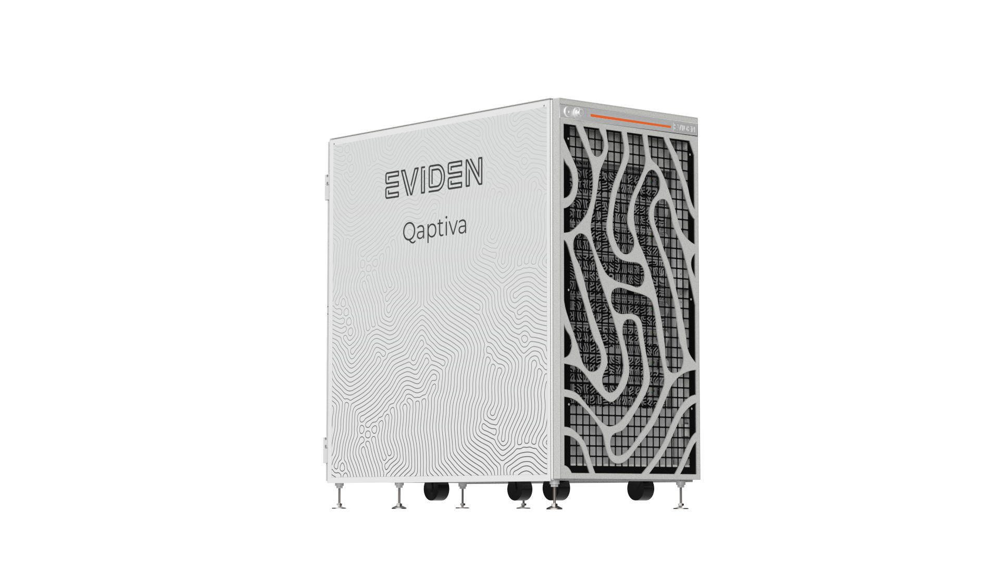

# Le programme HQI

La stratégie du [Plan National Quantique](https://www.entreprises.gouv.fr/fr/numerique/politique-numerique/strategie-nationale-pour-technologies-quantiques) s’inscrit dans les objectifs France 2030. Ce plan vise notamment à :

> Mettre à disposition de nouveaux moyens pour les chercheurs, mais aussi pour les startups et les industriels

> Générer des investissements stratégiques dans les technologies quantiques appliqués au calcul, aux communications, aux capteurs, et à la cryptographie

> Développer l’informatique quantique.

[HQI (France Hybrid Quantum Initiative)](https://hqi.fr) est une initiative intégrée au Plan. Elle associe une plateforme de calcul hybride couplant plusieurs technologies quantiques au supercalculateur Joliot Curie de GENCI au TGCC (CEA), et un programme de recherche – académique et industrielle, et de dissémination des usages.

<center>

</center>
<p>© P.Stroppa</p>

# Ressources de calcul quantique

L'un des volets du programme HQI est la mise à disposition d'une plateforme de calcul hybride, interconnectant systèmes de calcul classiques et dispositifs quantiques, vus alors comme des accélérateurs. Elle sera mise à disposition d’une communauté internationale regroupant des laboratoires, des startups et des industriels. **L’objectif** ? Faciliter leur accès aux capacités de calcul quantique, afin d’être en mesure d’identifier, de développer et de tester de nouveaux cas d’usages.

## Les systèmes disponibles

### Émulateur Eviden (~40 qubits)

Un émulateur quantique capable de simuler jusqu'à 40 Qubits parfaits et intriqués. Il permet d'utiliser différents émulateurs (Pulser, Perceval, MyQLM et d'autres à venir).
Il peut aussi servir de module d’hybridation entre calcul HPC et quantique.

Il s'éxecute grâce à l'environnement [Qaptiva](./myqlm.ipynb).

<center>

</center>
<p>© Bull SAS</p>

### Ordinateur à atomes neutres Pasqal (+100 qubits)

L'ordinateur à atomes neutres de Pasqal sera mise en service avant la fin de l'année 2024. Ce dernier sera couplé au supercalculateur Jolio-Curie, permettant l'éxecution d'algorithmes hybride classique/quantique. 

Il s'éxecute grâce à [Pulser](./pulser.ipynb), la biliothèque Python de Pasqal.

<center>

</center>
<p>© Pasqal</p>

### Ordinateur photonique (arrivé prévue en 2025)

Dans le cadre d'EuroQCS-France, un deuxième appel d'offre concernant un ordinateur quantique photonique a été lancé. Le constructeur sélectionné n'a pas encore été annoncé. Cependant, vous pouvez d’ores et déjà retrouver la bibliothèque [Perceval](./perceval.ipynb) pour l'informatique photonique.


## Table des matières

```{tableofcontents}
```
