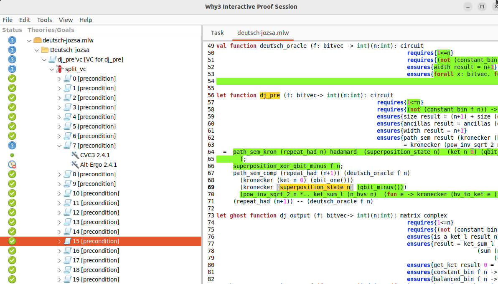

# [Qbricks](https://qbricks.github.io/)


Qbricks est un environnement open-source pour la vérification formelle automatisée des programmes quantiques. Il permet d'écrire des programmes de construction de circuits quantiques, spécifiés avec leurs fonctions d'E/S et/ou leurs besoins en ressources. Son langage hôte, l'environnement de vérification déductive Why3, fournit une interface, permettant un haut niveau d'automatisation dans la vérification des spécifications Qbricks.

```{admonition} Voir également
:class: seealso
L'article des auteurs de Qbricks : [An Automated Deductive Verification Framework for Circuit-building Quantum Programs](https://github.com/Qbricks/qbricks.github.io/files/6414263/final--ESOP-2021.pdf) et le répertoire [Github](https://github.com/Qbricks/qbricks.github.io) du projet
```

## Méthode formelle

Dans de nombreux domaines critiques (nucléaire, ferroviaire, etc.), il est nécessaire de garantir l'absence de bugs dans les logiciels. Pour cela, les méthodes formelles apparaissent comme des techniques efficaces permettant de raisonner logiquement sur un programme informatique, afin de démontrer la validité de ce dernier par rapport à une spécification.

## Exemple : Deutsch-Jozsa

Après avoir téléchargé et installer Qbricks et Why3 selon les [instructions des développeurs](https://github.com/Qbricks/qbricks.github.io/tree/main?tab=readme-ov-file#installation-1), rendez-vous dans le dossier Case_studies et démarrer le fichier 'deutsch-jozsa.mlw' avec la commande suivante.

```batch
why3 ide deutsch_jozsa.mlw
```
