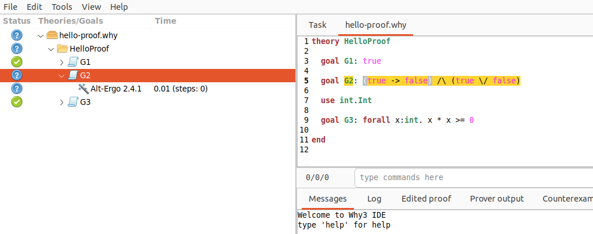
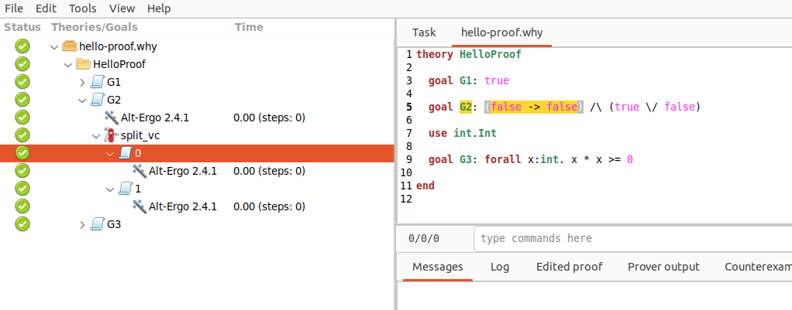

# [Qbricks](https://qbricks.github.io/)


Qbricks est un environnement open-source pour la vérification formelle automatisée des programmes quantiques. Il permet d'écrire des programmes de construction de circuits quantiques. Son langage hôte, [Why3](https://www.why3.org), fournit une interface permettant un haut niveau d'automatisation dans la vérification des spécifications Qbricks. Sur cette page, nous détaillerons les différentes spécificités de Why3 et des outils constituant l'environnement.

```{admonition} Voir également
:class: seealso
L'article des auteurs de Qbricks : [An Automated Deductive Verification Framework for Circuit-building Quantum Programs](https://github.com/Qbricks/qbricks.github.io/files/6414263/final--ESOP-2021.pdf) et le répertoire [Github](https://github.com/Qbricks/qbricks.github.io) du projet
```

## Méthode formelle

Dans de nombreuses industries critiques (nucléaire, ferroviaire, etc.), il est nécessaire de garantir l'absence de bugs dans les logiciels. Plusieurs méthodes existent telles que la simulation, le test ou bien la vérification d'assertions. Cependant, les méthodes formelles proposent de vérifier sémantiquement le bon déroulé d'un programme, selon un formalisme mathématique. Afin d'utiliser ces méthodes, [Why3](https://www.why3.org) est la plateforme graphique de vérification déductive que nous allons utiliser. 
```{list-table}
:header-rows: 1
:name: example-table

* - Méthode
  - Vérification d'assertions
  - Simulation
  - Test
  - Méthode formelle
* - Principe
  - Vérifie la validité des assertions pendant l'exécution d'un programme
  - Exécution d'un modèle simplifié pour vérifier le comportement
  - Test de l'algorithme sur tous les cas possibles
  - Vérification de la logique mathématique du programme
* - Inconvénients
  - Requiert des mesures destructives avec des états fortement superposés
  - Nécessite un ordinateur quantique
  - Ne permet pas de cibler la source de l'erreur
  - RAS (dans ce cas)
```

_In fine_, la vérification formelle permet une analyse statique (qui ne nécessite pas d'exécution), insensible à l'échelle (ex: nombre de qubits), et respectant un formalisme mathématique défini.

### Hello Proofs

Nous allons décortiquer l'exemple [Hello Proofs](https://www.why3.org/doc/starting.html#hello-proofs) de la documentation Why3. C'est un algorithme basique, équivalent au Hello World. Il est constitué de 3 objectifs distincts que nous allons essayer de prouver.

Les `theory` sont les ensembles d'objectifs, définitions et preuves. 
```batch 
theory HelloProof
```

Les `goal` sont les objectifs, ici des assertions comme "prouver que G1 est True", ce ne peut être que vrai ici. L'objectif G2 utilise les injonctions AND `/\`, OR `\/` et l'implication `->` de Why3. Nous verrons plus tard en quoi l'objectif G2 pose problème.
```batch
goal G1: true
goal G2: (true -> false) /\ (true \/ false)
```

Après avoir importé `Int` du module `int`, nous allons l'utiliser dans le goal G3, consistant à prouver que le carré d'un nombre entier est toujours non négatif. 
```batch
use int.Int
goal G3: forall x:int. x * x >= 0

end
```

### Prover 

En vérification formelle, on utilise des provers. Ce sont des démonstrateurs de théorème, qui nous permettent de vérifier les assertions proposées dans Why3. Il existe différents provers en fonction du contexte. Leur utilisation peut se combiner sur une même théorie. Ceux utilisé par Qbricks sont [Z3](https://github.com/Z3Prover/z3), [CVC3](https://cs.nyu.edu/acsys/cvc3/) et [4](https://cvc4.github.io/), et [Alt-Ergo](https://alt-ergo.ocamlpro.com/), que nous utilisons également pour vérifier Hello Proofs.

### Vérification


<p>Bienvenue sur l'interface Why3 sur notre exemple Hello Proofs, après avoir éxecuté le proveur Alt-Ergo</p>

Nous pouvons voir que les _Status_ ne sont pas tous validés. La non-validation du goal G2 entraîne la non validation de toute la théorie. En effet, l'implication `true -> false` signifiant "si vrai alors faux" est faux par définition. Nous pouvons le vérifier en séparant le goal en deux assertions grâce à l'outil _Split_ dans l'onglet _Tools_. 


<p>Nous venons de 'split' le goal G2 en deux assertions à vérifier distinctement</p>

L'assertion G.2.0 n'est pas vérifié par Why3 après le split, nous sommes donc sûr que c'est la première implication qui est fausse. Nous corrigeons `true -> false` par `false -> false`.



Maintenant, toute la théorie HelloProof est vérifiée !

## Exemple : Pile ou face (Cointoss)

Après avoir téléchargé et installé Qbricks et Why3 selon les [instructions des développeurs](https://github.com/Qbricks/qbricks.github.io/tree/main?tab=readme-ov-file#installation-1), nous créons un nouveau fichier nommé _cointoss.mlw_.

Nous allons importer les composants intéressants de Qbricks pour appliquer la porte de Hadamard.

```batch
module Hadamard

  use wired_circuits.Circuit_c
  use wired_circuits.Qbricks_prim
  use int.Int
  use unit_circle.Angle
```

Ci-dessous, vous pouvez voir les conditions (ensures) pour appliquer la porte de Hadamard.
```batch
  let circ  (): circuit 
    ensures {width result = 1} 
    ensures {range result = 1} 
```

Nous pouvons remarquer que la définition de la porte de Hadamard ne se fait pas selon sa représentation matricielle, mais selon des fonctions de transformation des registres quantiques. La multiplication d’une matrice par un vecteur est remplacée par une décomposition en somme de produits de vecteurs. On représente ainsi les circuits comme des sommes de vecteurs, appelées des sommes de chemins comme ici Hadamard :

$
H \left| x \right\rangle \mapsto \frac{1}{\sqrt{2}} \sum_{y \in \mathbb{Z}_2} e^{2 \pi i \frac{xy}{2}} \left| y \right\rangle
$

```{admonition} Explication
:class: seealso
Vous pouvez retrouver l'explication complète de la somme des chemins dans cet [article](https://arxiv.org/pdf/1805.06908) 
```

Nous pouvons voir ci-dessous
```batch
    ensures {forall x y. ang_ind result x y  =  (x 0 * y 0) /./ 1}
    ensures {forall x y. basis_ket result x y 0 = y 0}
  =
    hadamard 

end
```

avec (x 0 * y 0) /./ 1 qui calcule $\frac{xy}{2}$, et basis_ket result x y 0 = y 0 la signature de sortie $\left|y \right\rangle$

En exécutant le code avec Why3, et en appliquant les provers utilisés par Qbricks, vous pouvez alors vérifier le respect des principes de la physique quantique apportés par Qbricks pour la transformation de Hadamard.